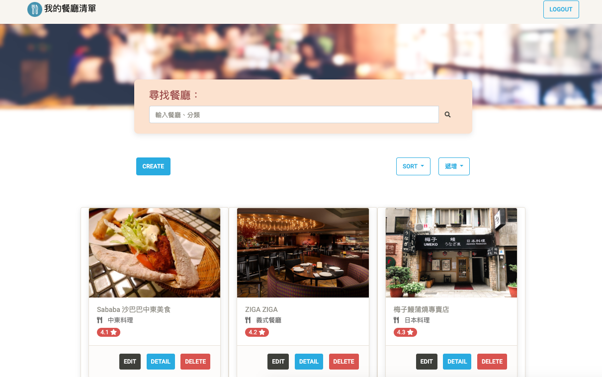
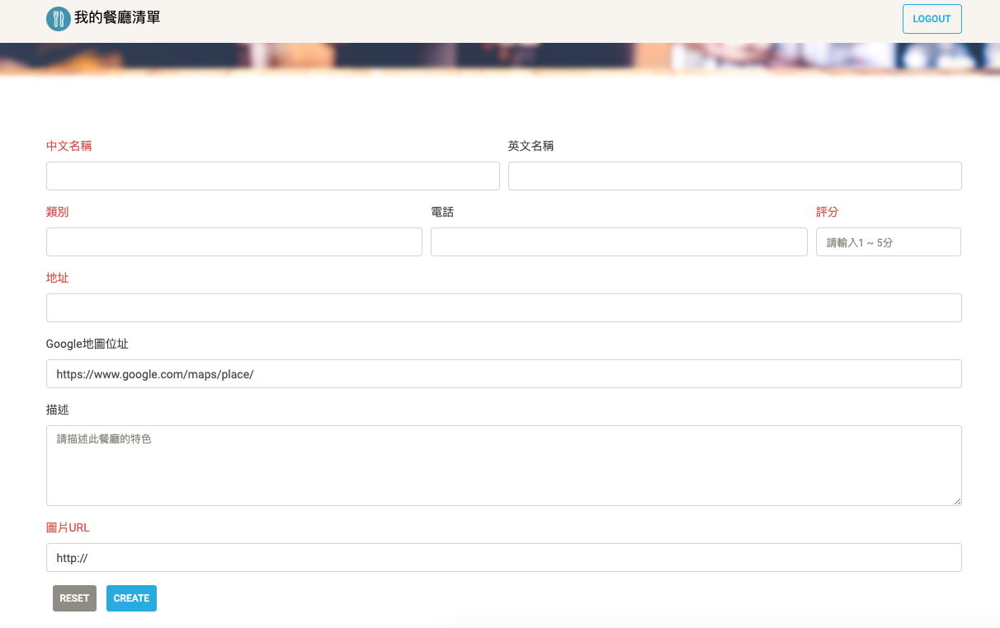
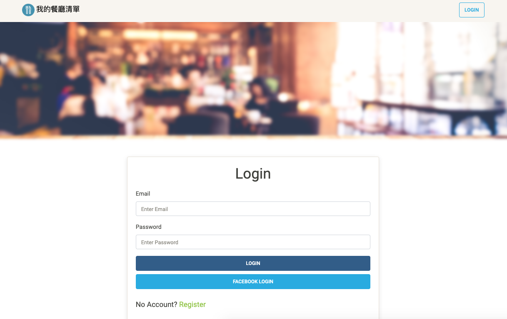

# 我的餐廳清單- 新增登入功能 (Restaurant List- with Login Function)

使用 Node.js + Express 打造的餐廳清單網站，以 RESTful 路由重構，可提供使用者註冊，登入後可管理個人餐廳清單，包括新增、閱讀、修改、刪除餐廳資訊等功能，也可依照餐廳名稱與分類進行搜尋，以及依照餐廳名稱、類別、地區、評分進行排序。

## 環境建置與需求 (Prerequisites)

* [Node.js](https://nodejs.org/)
* [Express ^4.17.1](https://expressjs.com)
* [Express-Handlebars ^3.1.0](https://www.npmjs.com/package/express-handlebars)
* [Body-Parser ^1.19.0](https://www.npmjs.com/package/body-parser)
* [MongoDB ^4.0.13](https://www.mongodb.com/)
* [Mongoose ^5.7.10](https://mongoosejs.com/)
* [Method-Override ^3.0.0](https://www.npmjs.com/package/method-override)
* [Bcryptjs ^2.4.3](https://www.npmjs.com/package/bcryptjs)
* [Connect-Flash ^0.1.1](https://www.npmjs.com/package/connect-flash)
* [Dotenv ^8.2.0](https://www.npmjs.com/package/dotenv)
* [Express-Session ^1.17.0](https://www.npmjs.com/package/express-session)
* [Passport ^0.4.0](https://www.npmjs.com/package/passport)
* [Passport-Facebook ^3.0.0](http://www.passportjs.org/packages/passport-facebook/)
* [Passport-Local ^1.0.0](http://www.passportjs.org/packages/passport-local/)

## 安裝與執行步驟 (Installing and execution)

1.開啟終端機(Terminal)，clone到本機專案位置:

```
git clone https://github.com/bluesmy/restaurant_list_with_login_function.git
```

2.切換至專案資料夾

```
cd restaurant_list_with_login_function
```

3.安裝套件
```
npm install  //自動安裝package.json內套件
```

4.事先安裝完MongoDB後，啟動MongoDB伺服器

```
[~/mongodb/bin] ./mongod --dbpath ~/mongodb-data --bind_ip 127.0.0.1
```

5.匯入種子檔案

```
node models/seeds/seeder.js  //匯入種子用戶、種子餐廳資料
```

當終端機出現以下字樣，表示種子資料已新增至資料庫，按下 Ctrl + C 結束執行

```
db connected!

done
```

6.啟動伺服器，並執行專案

```
npm run dev
```

7.當終端機顯示以下字樣，表示伺服器與資料庫已啟動並成功連結
`App is running
mongodb connected!`

```
Ctrl + C *2  //連按兩下 Ctrl + C 關閉伺服器
```

瀏覽器輸入 [http://localhost:3000](http://localhost:3000) 即可開始使用。

## 功能描述 (Features)

- 使用者可註冊帳號
- 使用者可依據註冊之帳號密碼登入，或使用第三方快速登入（Facebook）
- 使用者可於首頁瀏覽所有餐廳照片、餐廳名稱、餐廳分類、餐廳評分
- 使用者可新增、編輯、刪除餐廳資訊
- 使用者可瀏覽一間餐廳的詳細資訊（包含類別、地址、電話、描述、圖片）
  - 點選地址旁圖示可開啟新分頁查看Google Map上該地點資訊
- 使用者可依照餐廳名稱及餐廳類別來搜尋餐廳
- 使用者可依照餐廳名稱、類別、地區、評分進行升冪或降冪排序

## 測試帳號＆密碼 (Test Accounts & Passwords)

| Email             | Password | 擁有餐廳編號       |
| --------───────-- | -------- | ---------------- |
| user1@example.com | 12345678 | #1, #2, #3 號餐廳 |
| user2@example.com | 12345678 | #4, #5, #6 號餐廳 |

## 專案畫面 (Screenshot)

)





## 專案使用工具 (Built With)

* [Visual Studio Code](https://code.visualstudio.com/) - The integrated development environment used
* [Express](https://expressjs.com) - The web framework used
* [Express-Handlebars](https://www.npmjs.com/package/express-handlebars) - The template engine used
* [Body-Parser](https://www.npmjs.com/package/body-parser) - Parse incoming request bodies in a middleware before handlers
* [MongoDB](https://www.mongodb.com/) - The database used
* [Mongoose](https://mongoosejs.com/) - ODM of MongoDB
* [Method-Override](https://www.npmjs.com/package/method-override) - Enable usage of HTTP verbs such as PUT or DELETE
* [Bcryptjs](https://www.npmjs.com/package/bcryptjs) - Password hashing function used
* [Connect-Flash](https://www.npmjs.com/package/connect-flash) - Display flash message to user 
* [Dotenv](https://www.npmjs.com/package/dotenv) - Load environment variables from .env file into process.env
* [Express-Session](https://www.npmjs.com/package/express-session) - Enable session in express
* [Passport](https://www.npmjs.com/package/passport) - Authentication middleware for Node.js
* [Passport-Facebook](http://www.passportjs.org/packages/passport-facebook/) - Passport strategy for authenticating with Facebook using the OAuth 2.0 API
* [Passport-Local](http://www.passportjs.org/packages/passport-local/) - Passport strategy for authenticating with a username and password

## 專案開發人員 (Contributor)

* **Sheri Su** - [bluesmy](https://github.com/bluesmy)